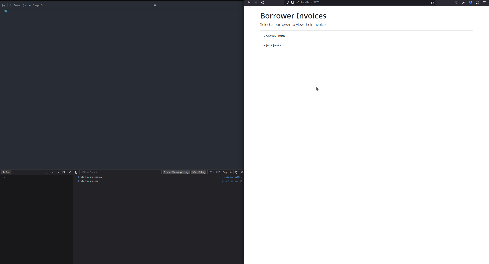

# Xen Platforms Interview Challenge

Example app for the Xen Platforms interview challenge.
- Gist with challenge and instructions: https://gist.github.com/thiagosil/ee725fa09c796a1b5727afaac07c6bc7
- Base template repository: https://github.com/Finvoice/xen_base_challenge

## Setup

### Obtain Code
Clone or download this repository.

### Install Dependencies

- SQLite3
    - Follow the [installation instructions for your platform](https://www.servermania.com/kb/articles/install-sqlite).

- OPTIONAL: Install the `asdf` runtime version manager: [https://asdf-vm.com/](https://asdf-vm.com/).
    - Install the Ruby `asdf` plugin: [https://github.com/asdf-vm/asdf-ruby](https://github.com/asdf-vm/asdf-ruby)
    - Install the NodeJS `asdf` plugin: [https://github.com/asdf-vm/asdf-nodejs](https://github.com/asdf-vm/asdf-nodejs)

- Node:
    - In your terminal, enter the project's root directory.
    - Manually install the Node version listed in `.tool-versions` or install using `asdf`: `asdf install`
    - Run `npm install` to install dependencies.

- Ruby:
    - In your terminal, enter the project's root directory.
    - Manually install the Ruby version listed in `.tool-versions` or install using `asdf`: `asdf install`
    - Install bundler: `gem install bundler`
    - Run `bundle install` to install dependencies.
    - Run `./bin/rails db:setup` to set up the database.
    - Load example data into the dev database via: `./bin/rails db:fixtures:load`

### Start the Application

1. In your terminal, enter the project's root directory.
1. Start the backend: `./backend/bin/rails server`
1. Start the frontend: `cd ./frontend/ && npm run dev`
1. Visit the indicated frontend URL.

## Run Tests

### Backend

1. In your terminal, enter the project's root directory.
1. Run: `cd ./backend && ./bin/rails test`

### Frontend

1. In your terminal, enter the project's root directory.
1. Run: `cd ./frontend && npm run test`

## Things to Note
- This project took a lot longer than 2 hours, but it was a ton of fun.
- The tests are a bit light; this is a function of ^^.